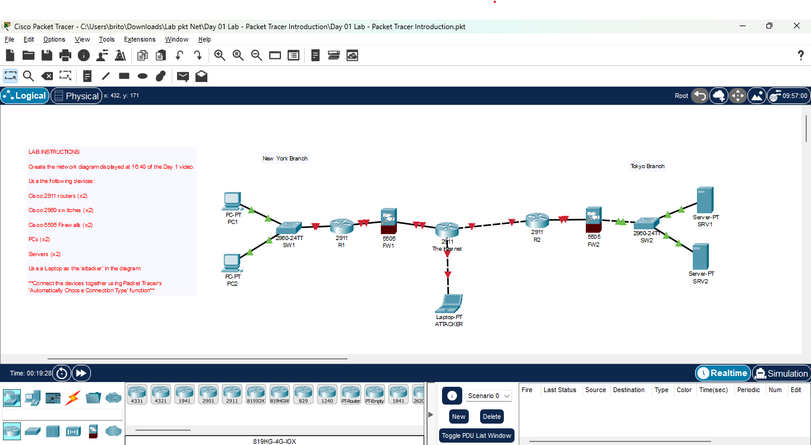

# Day 01 Lab – Packet Tracer Introduction 

**Name:** John Ashley Britos  
**Date:** July 7, 2025  
**Lab Title:** Day 01 Lab - Packet Tracer Introduction  
**Lab Tool:** Cisco Packet Tracer  
**File Name:** `Day 01 Lab - Packet Tracer Introduction.pkt`

---

## Objective

- Recreate the network topology shown at the 16:40 mark of the Day 01 instruction video.
- Place all required devices in Cisco Packet Tracer.
- Connect them using the **Auto Connection** feature.
- Label devices properly for clarity.
- Save the diagram file for later configuration labs.

---

## Network Diagram

  
*Figure 1: Day 01 Topology recreated in Cisco Packet Tracer*

---

## Devices Used

| Device Type | Model         | Quantity |
|-------------|---------------|----------|
| Router      | Cisco 2911    | 2        |
| Switch      | Cisco 2960    | 2        |
| Firewall    | Cisco ASA 5505| 2        |
| PC          | Generic PC    | 2        |
| Server      | Generic Server| 2        |
| Laptop      | Generic Laptop| 1        |
| Cable       | Auto Select   | As needed| 

---

## Steps Performed

1. Opened Cisco Packet Tracer.
2. Placed the following devices onto the workspace:
    - 2 Cisco 2911 Routers
    - 2 Cisco 2960 Switches
    - 2 ASA 5505 Firewalls
    - 2 Generic PCs
    - 2 Generic Servers
    - 1 Generic Laptop (used as the attacker)
3. Labeled each device using the **Note Tool** (e.g., "Router1", "FirewallA", "Attacker Laptop").
4. Used the **'Automatically Choose Connection Type'** feature to connect all devices logically, matching the topology from the 16:40 video.
5. Adjusted layout to be visually clean and organized.
6. Saved the file as `Day 01 Lab - Packet Tracer Introduction.pkt`.

---

## Issues Faced & Solutions

| Issue                            | Resolution                                         |
|----------------------------------|----------------------------------------------------|
| Unsure of correct port to connect| Let Auto Cable feature decide connections          |
| Device icons overlapping         | Rearranged devices using Select and Move tools     |

---

## Reflection

- Learned to recreate a professional network layout using only visual design.
- Practiced identifying devices and placing them accurately in Packet Tracer.
- Used Auto Cable to simplify port connection decisions.
