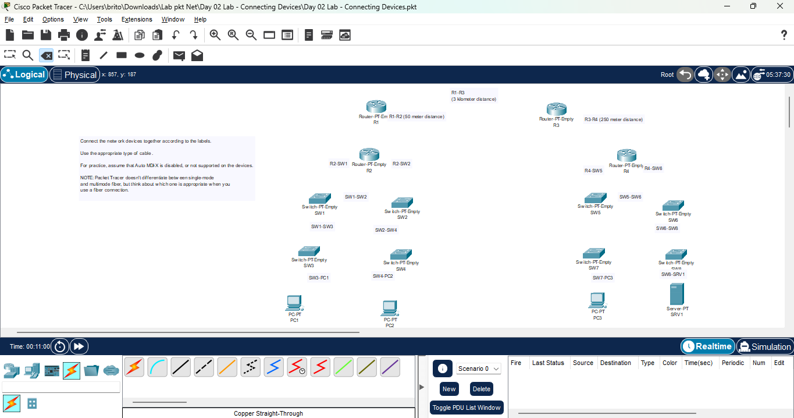
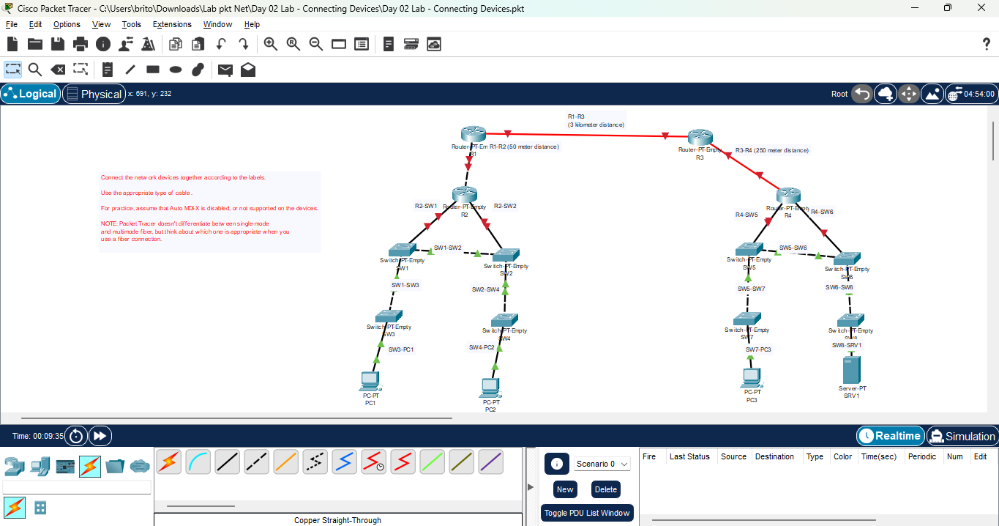

# Day 02 Lab - Connecting Devices

**Name:** John Ashley Britos
**Date:** July 7, 2025  
**Lab Title:** Day 02 Lab - Connecting Devices  
**Lab Tool:** Cisco Packet Tracer  
**File Name:** `Day 02 Lab - Connecting Devices.pkt`

---

## Objective

- Connect the network devices together according to the labels.
- Use the appropriate type of cable.
- For practice, assume that Auto MDI-X is disabled, or not supported on the devices.

NOTE: Packet Tracer doesn't differentiate between single-mode 
and multimode fiber, but think about which one is appropriate when you 
use a fiber connection.
 
---

## Network Diagram Before

  
*Figure 1: Initial Topology *

---

## Steps Performed
-  Reviewed the topology to understand the cable requirements between devices.
-  Manually cabled the devices according to IEEE 802.3 Ethernet and fiber optic standards, considering device types and cable requirements.
    
## Network Diagram Before

  
*Figure 2: Final Topology *

---

## Reflection

- Learned how to properly connect devices based on the requirements given. 
- learned IEEE 802.3 ethernet and fiber optic standards.

