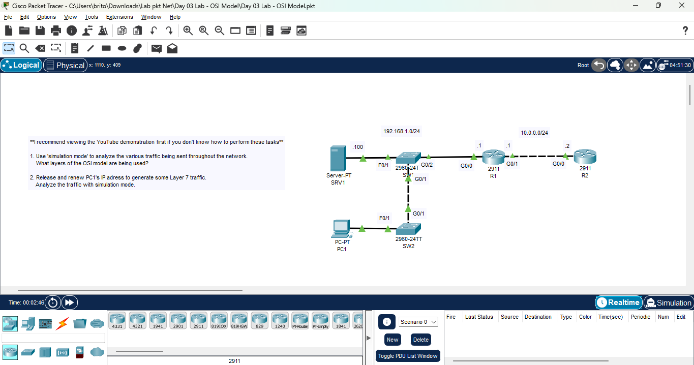
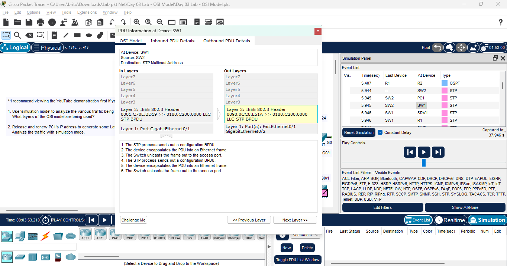

# Day 03 Lab - OSI Model

**Name:** John Ashley Britos
**Date:** July 7, 2025  
**Lab Title:** Day 02 Lab - Connecting Devices  
**Lab Tool:** Cisco Packet Tracer  
**File Name:** `Day 03 Lab - OSI Model.pkt`

---

## Objective

**I recommend viewing the YouTube demonstration first if you don't know how to perform these tasks**
1. Use 'simulation mode' to analyze the various traffic being sent throughout the network.
    What layers of the OSI model are being used?

2. Release and renew PC1's IP adress to generate some Layer 7 traffic.
    Analyze the traffic with simulation mode.
---

## Network Diagram 

  
📎 *Figure 1: Network Topology *

---

## Steps Performed

1. Opened **Simulation Mode** in Packet Tracer.
2. Filtered for relevant protocols: ARP, DHCP, DNS, ICMP, etc.
3. Observed existing background traffic between devices.
4. Selected **PC1**, opened Command Prompt:
    - Ran `ipconfig /release`
    - Then ran `ipconfig /renew` to trigger DHCP traffic.
5. Tracked the resulting **DHCP Discover → Offer → Request → ACK** exchange.
6. Analyzed each packet and mapped it to the appropriate **OSI layers**.
---

## Screenshots

  
*Figure 2: Simulation mode *

---

### OSI Layer Breakdown of Observed Protocols

| Protocol | OSI Layers Used                             |
|----------|---------------------------------------------|
| ARP      | Layer 2 – Data Link                         |
| ICMP     | Layer 3 – Network (with Layer 2 frame)      |
| DHCP     | Layer 7 – Application (UDP > IP > Ethernet) |

## Reflection

- Learned how to analyze network traffic using Packet Tracer’s Simulation Mode.  
- Understood how different protocols operate at specific OSI layers.  
- Observed Layer 2 traffic like ARP and Layer 7 traffic like DHCP.  
- Gained a clearer understanding of encapsulation and how data flows through the network stack.  
