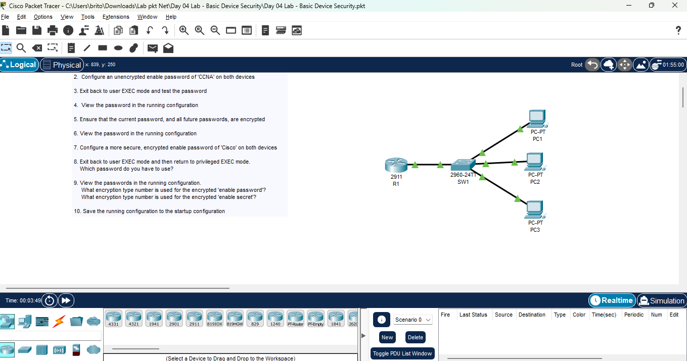

# Day 04 Lab - Basic Device Security

**Name:** John Ashley Britos
**Date:** July 7, 2025  
**Lab Title:** Day 04 Lab - Basic Device Security 
**Lab Tool:** Cisco Packet Tracer  
**File Name:** `Day 04 Lab - Basic Device Security.pkt`

---

## Objective

1. Change the hostnames of the router and switch to the appropriate names (R1, SW1)
     ##Use the 'hostname' command in global configuration mode##

2. Configure an unencrypted enable password of 'CCNA' on both devices

3. Exit back to user EXEC mode and test the password

4.  View the password in the running configuration

5. Ensure that the current password, and all future passwords, are encrypted

6. View the password in the running configuration

7. Configure a more secure, encrypted enable password of 'Cisco' on both devices

8. Exit back to user EXEC mode and then return to privileged EXEC mode.
    Which password do you have to use?

9. View the passwords in the running configuration.
     What encryption type number is used for the encrypted 'enable password'?
     What encryption type number is used for the encrypted 'enable secret'?

10. Save the running configuration to the startup configuration

---

## Network Topology

  
*Figure 1: Network Topology *
---

## Steps performed
1. Opened the CLI of the router and the switch.
2. Change the hostname of both using **hostname** command.
  
*Figure 2: Hostname configuration using 'hostname' command *

3. Enable password ( CCNA ) using enable password **CCNA**.
  
*Figure 3: Enabling password using enable password command *

4. Exit back to the user exec mode to test the password.
5. View the password in the running config.

  
*Figure 4: Viewing the password using show run command *

6. Encrypted the password and view it again.
  
*Figure 5: Password encryption using service password-encryption *

7. Configured a more secure password using the **enable secret** command.
  
*Figure 6: New way of securing the devices using the enable secret command *

8. Saved the configuration using the **write** command.
  
*Figure 7: Saved the modified configuration using the write command *
---

### Password Behavior Observed

- After configuring `enable secret`, the device required the **secret password (Cisco)** to access privileged EXEC mode.
- In the running configuration:
  - `enable password` uses **Type 7** encryption (reversible)
  - `enable secret` uses **Type 5** encryption (hashed and more secure)

## Reflection  
- Learned and understood basic security measures for Cisco devices.  
- Learned basic commands for configuring and viewing device information.  
- Learned how to save modified configurations using the `write` command.  

---