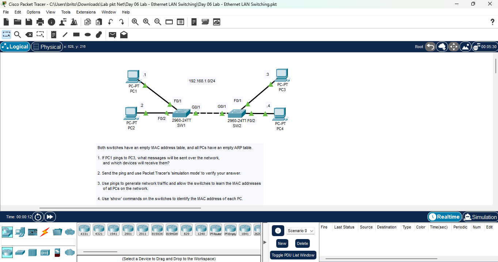
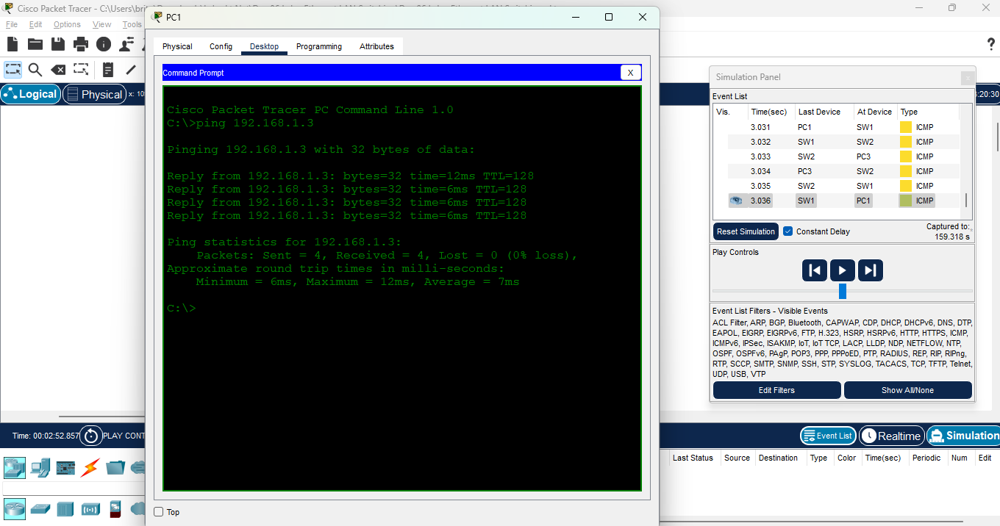
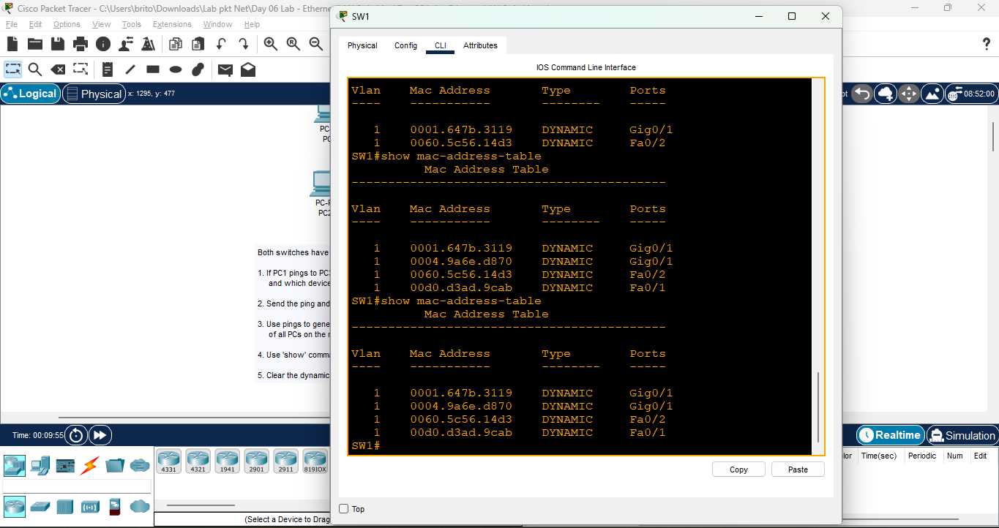
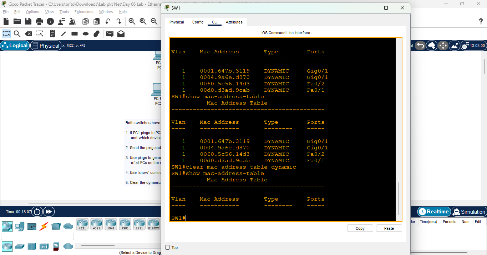

# Day 06 Lab - Ethernet LAN Switching

**Name:** John Ashley Britos   
**Date:** July 7, 2025  
**Lab Title:** Day 06 Lab - Ethernet LAN Switching  
**Lab Tool:** Cisco Packet Tracer  
**File Name:** `Day 06 Lab - Ethernet LAN Switching.pkt`

---

## Objectives

Both switches have an empty MAC address table, and all PCs have an empty ARP table.

1. If PC1 pings PC3, what messages will be sent over the network, and which devices will receive them?  
2. Send the ping and use Packet Tracer's Simulation Mode to verify your answer.  
3. Use pings to generate network traffic and allow the switches to learn the MAC addresses of all PCs.  
4. Use `show` commands on the switches to identify the MAC address of each PC.  
5. Clear the dynamic MAC addresses from the MAC address table of each switch.  

---

## Network Topology

  
*Figure 1: Network Topology*

---

## Steps Performed

1. Opened the command prompt on PC1.  
2. Used Simulation Mode and pinged PC3 (192.168.1.3) from PC1.  
  
*Figure 2: PC1 pinging PC3 in Simulation Mode*  

3. Used PC2 to ping PC4 (192.168.1.4).  
4. Viewed the MAC address of each PC using the `show mac address-table` command.  
  
*Figure 3: Viewing MAC address table on the switch*  

5. Cleared the MAC address table using the `clear mac address-table dynamic` command.  
  
*Figure 4: MAC address table cleared*  

---

## Lab Analysis

1. PC1 sends an ARP request (broadcast) to all hosts on the network to resolve PC3's IP address into a MAC address. PC3 responds with an ARP reply (unicast) containing its MAC address.  
   - This happens when the sender knows the IP but not the MAC address.  

2. Switches dynamically learn MAC addresses by examining the **source MAC** of incoming Ethernet frames and associating them with the corresponding switch port.  
   - I also observed that MAC addresses disappear after some time due to **aging** 
---

## Reflection

- Learned how ARP resolves IP addresses into MAC addresses using broadcast and unicast messages.  
- Understood how switches build and clear the MAC address table dynamically.  
- Practiced using ping and simulation mode to generate and observe Layer 2 and Layer 3 network behavior.  
- Learned useful switch commands like `show mac address-table` and `clear mac address-table dynamic`.  

---
