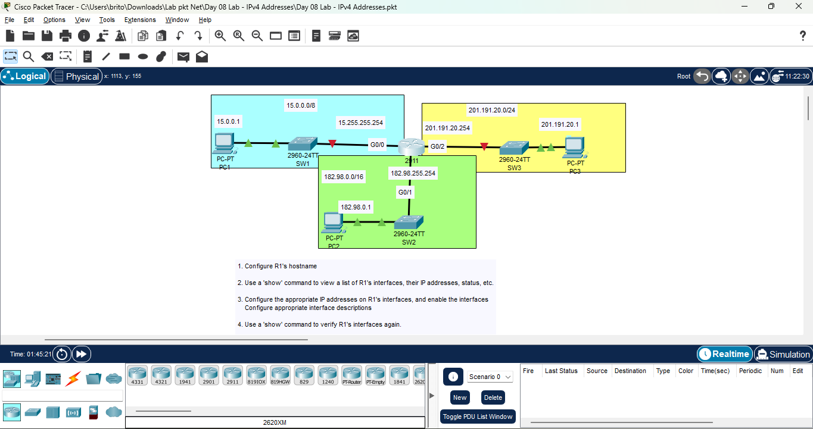
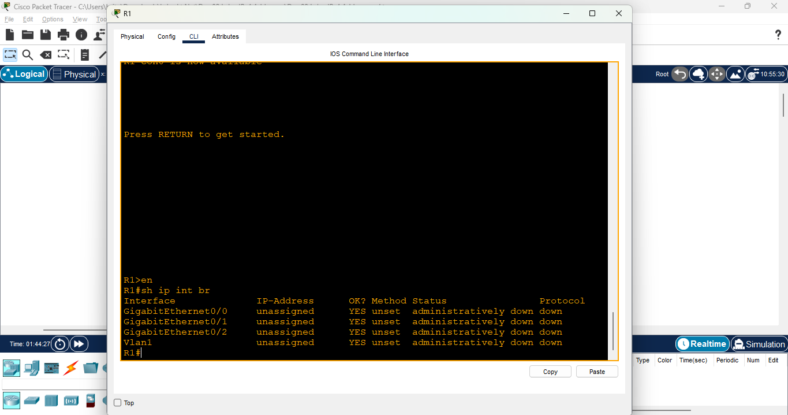
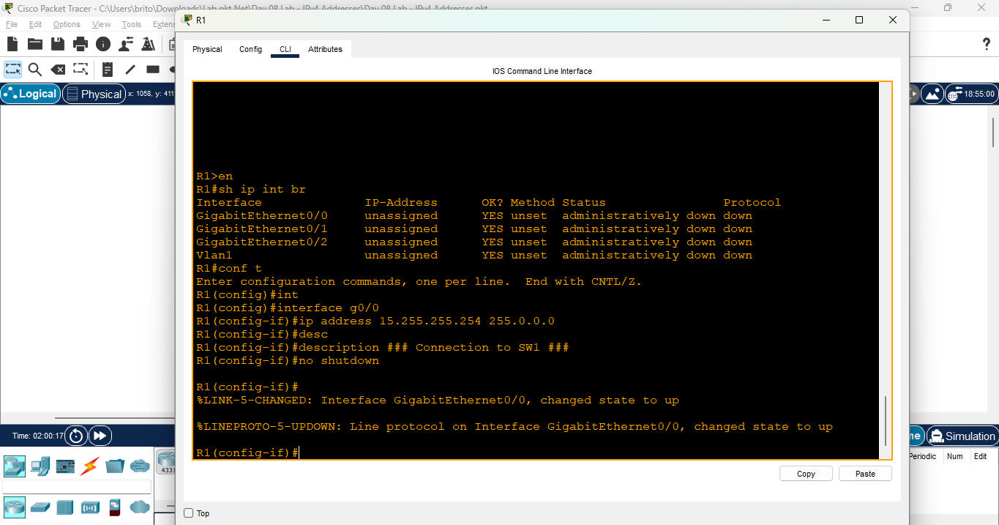
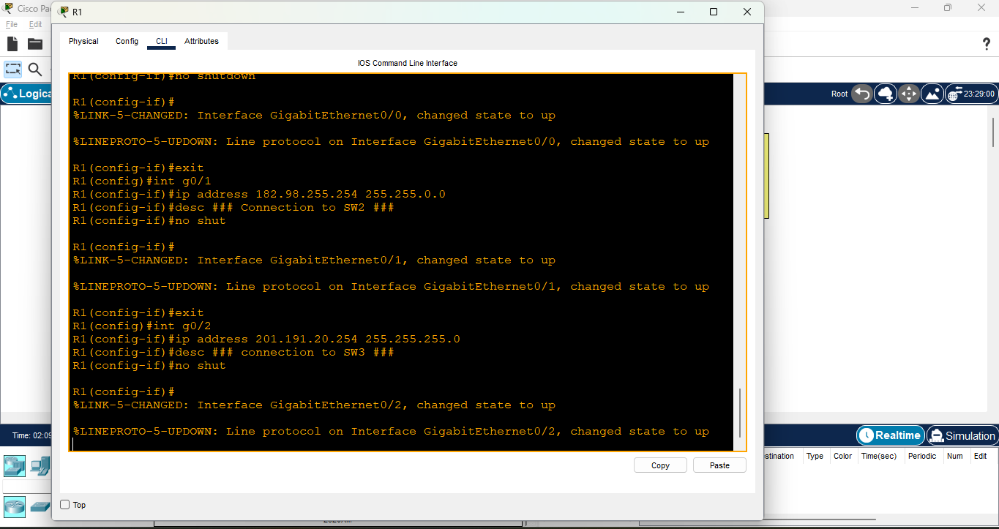
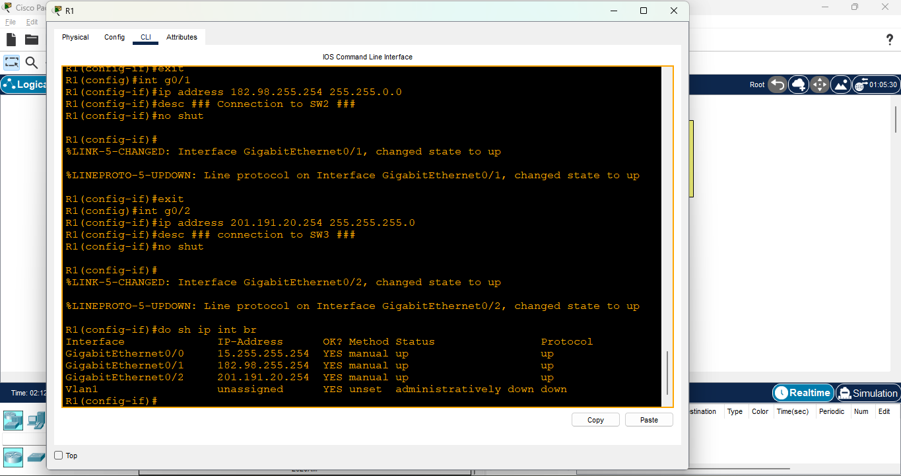
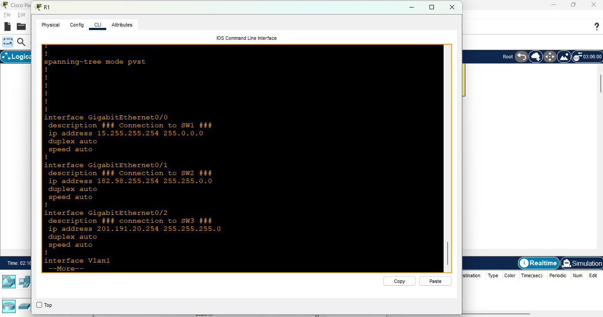
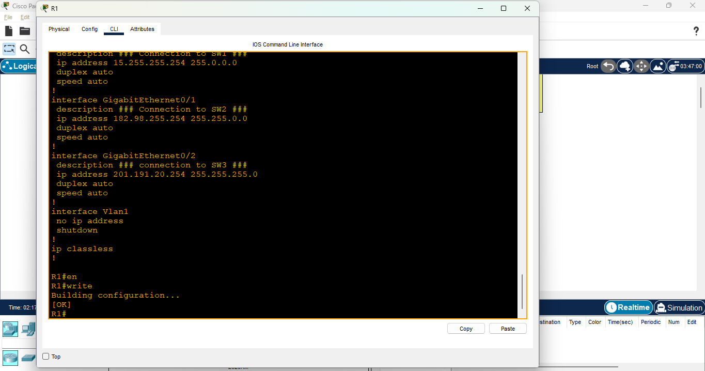
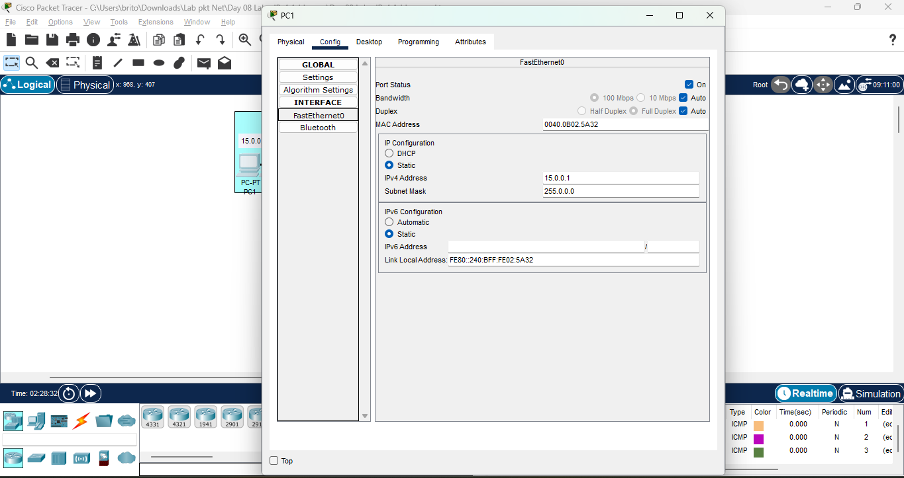
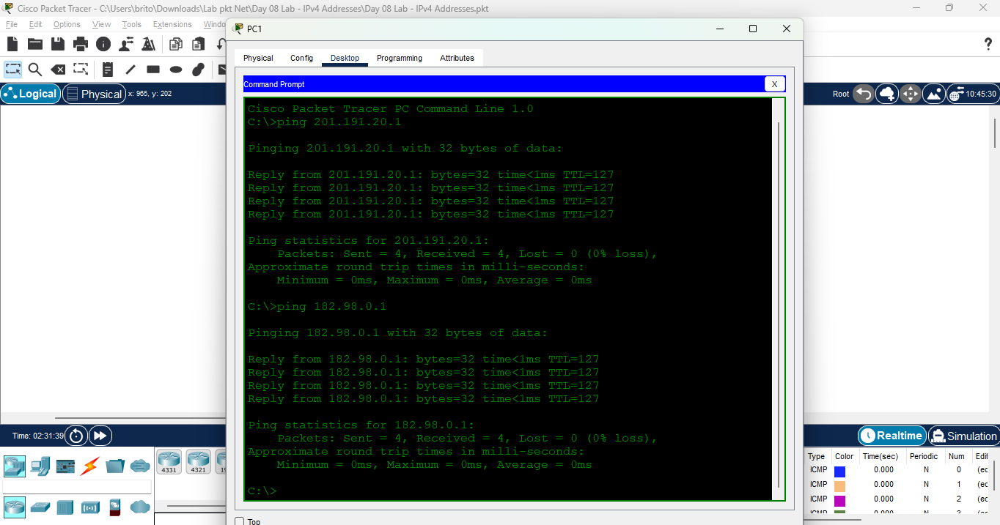

# Day 08 Lab - IPv4 Addresses

**Name:** John Ashley Britos  
**Date:** July 8, 2025  
**Lab Title:** Day 08 Lab - IPv4 Addresses 
**Lab Tool:** Cisco Packet Tracer  
**File Name:** `Day 08 Lab - IPv4 Addresses.pkt`

---

## Objective

1. Configure R1's hostname
2. Use a 'show' command to view a list of R1's interfaces, their IP addresses, status, etc.
3. Configure the appropriate IP addresses on R1's interfaces, and enable the interfaces
    Configure appropriate interface descriptions
4. Use a 'show' command to verify R1's interfaces again.
5. View the running config to confirm the configuration changes, then save the config
6. Configure the IP addresses of PC1, PC2, and PC3
7. Ping from PC1 to PC2 and PC3 to test connectivity

---

## Network Topology 

  
*Figure 1: Network Topology*

---

## Steps Performed
1. Configured the hostname of the router into R1 using **hostname** command.
2. Displayed the list of R1's interfaces, IP addresses, status and protocol using the **show ip interfaces brief** command
  
*Figure 2: Interfaces, status etc. of the R1*

3. Enter privileged EXEC mode then entered **interface g0/0** to enter the interface configuration mode
of interface gigabitethernet0/0.
4. Used **ip address 15.255.255.254 255.0.0.0** to add IP address and subnet mask to g0/0 interface and used **description** command to give it a description.
5. Used **no shutdown** command to enable the g0/0 interface.
  
*Figure 3: Adding IP address and subnet mask to g0/0, give description and enabling interface*

6. Configured IP addresses and descriptions for g0/1 **ip address 182.98.255.254 255.255.0.0** and g0/2 **ip address 201.191.20.254 255.255.255.0** interfaces using the same method
  
*Figure 4: Adding IP address and subnet mask to g0/0, give decription and enabling interface*

7. Used **show** again to verify the configurations I made.
  
*Figure 5: show configured interface table*

  
*Figure 6: show configured interface table using show run*

8. Saved the configuration of R1 using **write** command
  
*Figure 7: GUI configure*
9. Configured the IP addresses of host PC1 **15.0.0.1** , PC2 **182.98.0.1**, PC3 **201.191.20.1** using the GUI.
  
*Figure 7: GUI configure*

10. Ran some ping tests to test connectivity.
  
*Figure 8: ping test*

---

## Reflection

- Learned how to determine network address, broadcast address, first and last usable IP addresses.
- Understood the structure and classes of IPv4 addresses and their corresponding subnet masks.
- Practiced configuring IPv4 addresses and interface descriptions using the Cisco CLI
- Discovered useful commands such as show ip interface brief and description.
- Successfully tested end-to-end connectivity across multiple LANs.