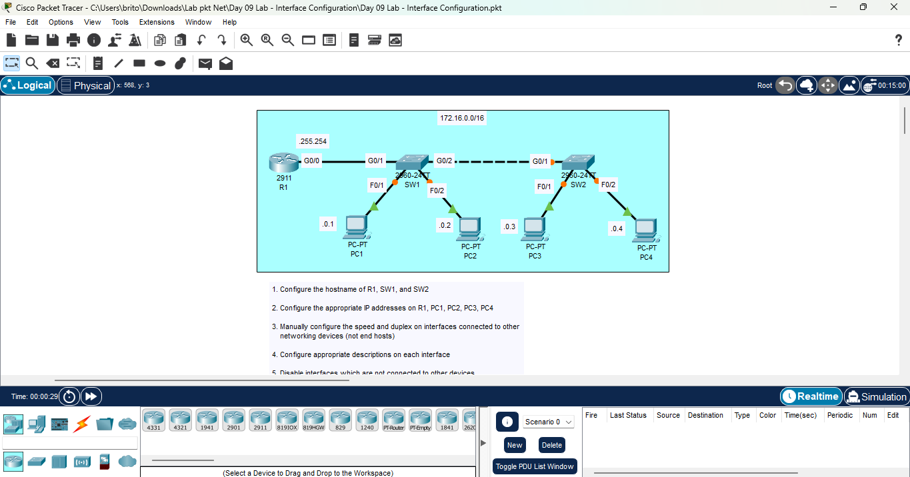
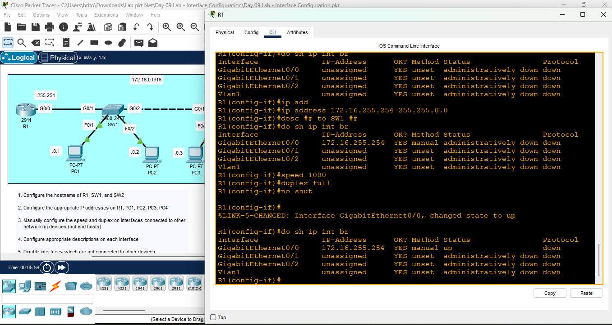
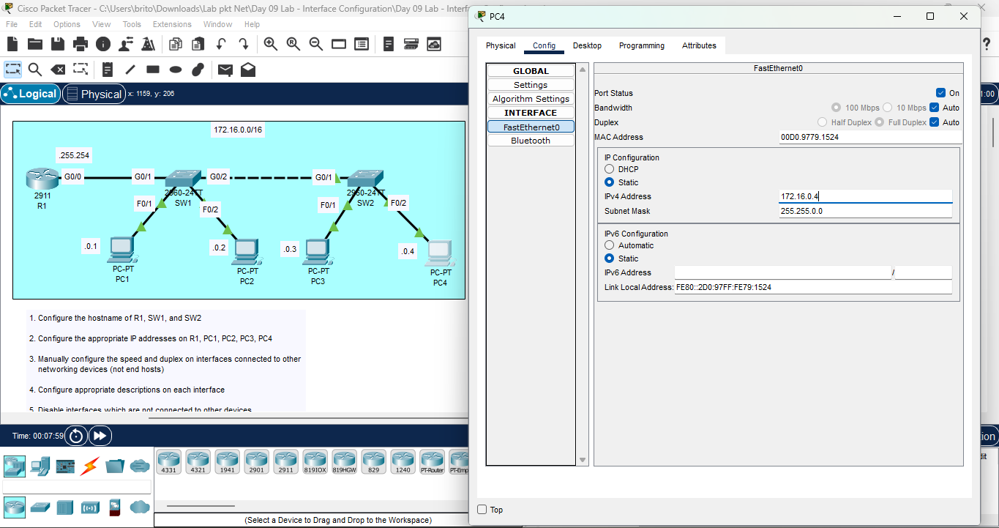
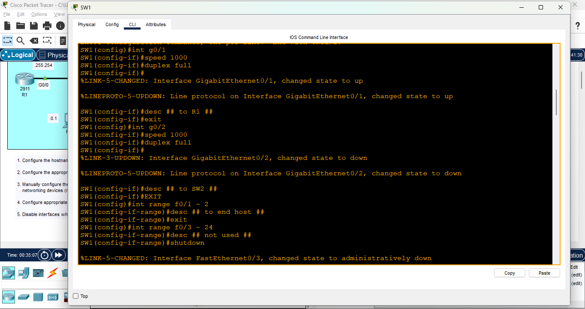
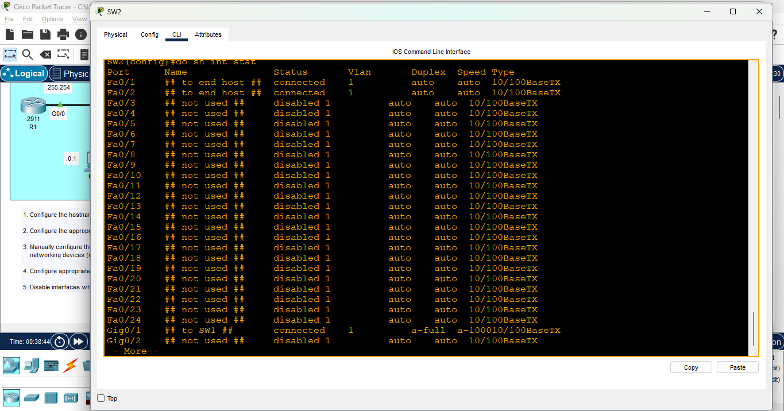

# Day 09 Lab - Interface Configuration

**Name:** John Ashley Britos  
**Date:** July 9, 2025  
**Lab Title:** Day 09 Lab - Interface Configuration  
**Lab Tool:** Cisco Packet Tracer  
**File Name:** `Day 09 Lab - Interface Configuration.pkt`

---

## Objective 

1. Configure the hostname of R1, SW1, and SW2
2. Configure the appropriate IP addresses on R1, PC1, PC2, PC3, PC4
3. Manually configure the speed and duplex on interfaces connected to other 
    networking devices (not end hosts)
4. Configure appropriate descriptions on each interface
5. Disable interfaces which are not connected to other devices

---

## Network Topology 

  
*Figure 1: Network Topology*

---

## Steps Performed 
1. Opened the CLI of the router, configured the hostname to R1, and assigned IP address **172.16.255.254 255.255.0.0** to interface g0/0.
Added a description for clarity, set the speed to 1000 and duplex to full, issued no shutdown, and saved the configuration.
  
*Figure 2: R1 Configuration*

2. Configured IP addresses on PC1 through PC4 via the GUI. Each device was assigned the appropriate IP based on the network design.
  
*Figure 3: End host configuration using GUI*

3. Accessed the CLI of SW1 and SW2, set the hostnames accordingly.
Added interface descriptions:
- to end host ## (e.g. PC1)
- to SW2 or R1 ## (uplink interfaces)
- not used ## (disabled ports)
Manually set speed and duplex to match connected devices (e.g. speed 1000, duplex full)
4. Shutdown all unused ports using **shutdown** command and saved configuration with **wr**.
  
*Figure 4: SW1 and SW2 configurations*

  
*Figure 5: SW1 and SW2 configurations*

---
## Reflection

- Learned how to manually configure interface settings such as speed and duplex.
- Understood the importance of speed and duplex matching to avoid collisions and errors.
- Learned how to use the interface range command to apply settings to multiple interfaces efficiently.
- This exercise helped reinforce best practices in switch and router configuration.

---