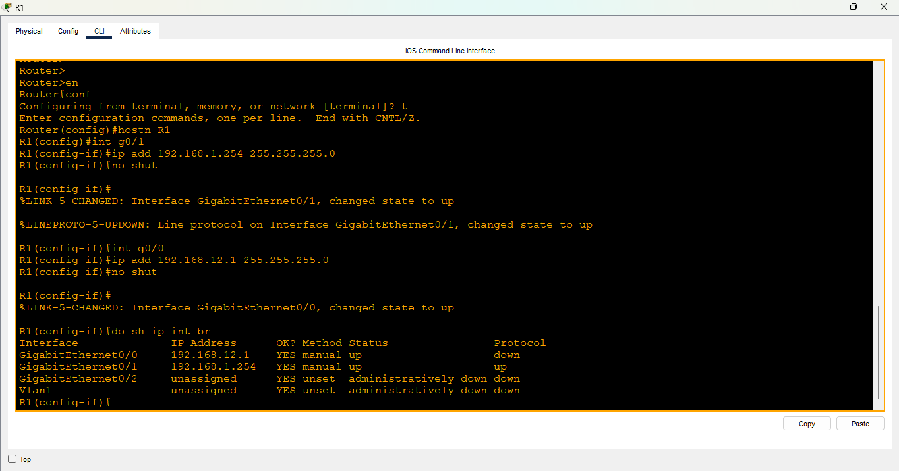
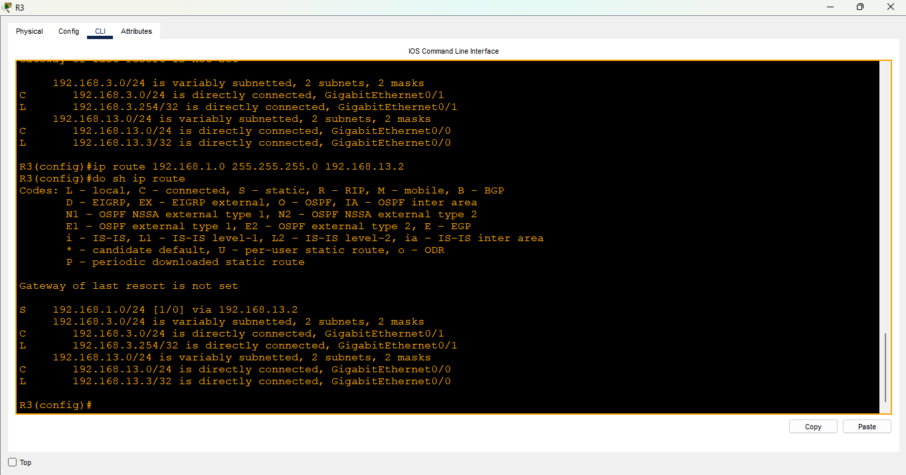

# Day 11 Lab - Configuring Static Routes

**Name:** John Ashley Britos  
**Date:** July 12, 2025  
**Lab Title:** Day 11 Lab - Configuring Static Routes     
**Lab Tool:** Cisco Packet Tracer  
**File Name:** `Day 11 Lab - Configuring Static Routes.pkt`

---

## Objective 
All devices have NO pre-configurations:

1. Configure the PCs and routers according to the network diagram (hostnames, IP addresses, etc.)
    Remember to configure the gateway on the PCs.
    (You don't have to configure the switches)

2. Configure static routes on the routers to enable PC1 to successfully ping PC2.

---

## Network Topology 
  
*Figure 1: Network Topology*

---

## Steps Performed 
1. Opened each router’s CLI to configure hostnames, IP addresses, and subnet masks. 
  
*Figure 2: R1 CLI*

  
*Figure 3: R2 CLI*

  
*Figure 4: R3 CLI*

2. Assigned IP addresses and default gateways to both end hosts. 
  
*Figure 5: HOST configurations*

3. Configured static routing on all routers to establish connectivity across the network.
  
*Figure 6: Static routing configuration for R1*

  
*Figure 7: Static routing configuration for R2*

  
*Figure 8: Static routing configuration for R3*

4. Verified network connectivity using the `ping` command from PC1 to PC2. 
  
*Figure 9: Ping test*

---

### Reflection 
- Learned to manually configure Static Routing using **ip route ip-addr netmask next-hop** as well as checking the route table using **show ip route**.
- I'm getting much more comfortable on using the CLI now.