# Day 11 Lab - Day 11 Lab - Troubleshooting Static Routes

**Name:** John Ashley Britos  
**Date:** July 12, 2025  
**Lab Title:** Day 11 Lab - Troubleshooting Static Routes       
**Lab Tool:** Cisco Packet Tracer  
**File Name:** `Day 11 Lab - Troubleshooting Static Routes.pkt`

---

## Objectives 
PC1 and PC2 are unable to ping each other.
There is one misconfiguration on each router.
Find and fix the misconfigurations.
You have successfully completed the lab when PC1 and PC2 can ping each other.

---

## Network Topology 
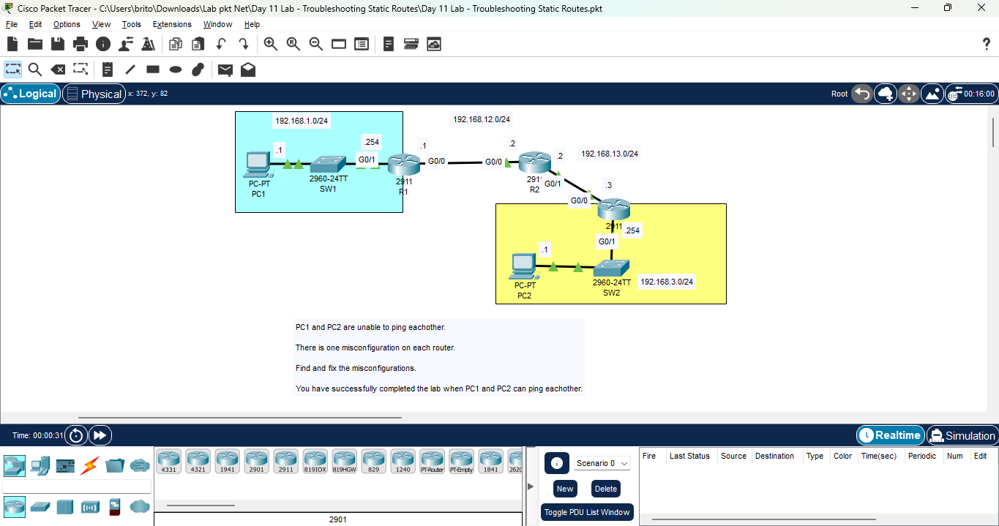  
*Figure 1: Network Topology*

---

## Steps Performed
1. Initial Connectivity Test - Used the ping command to test connectivity between PC1 and PC2.
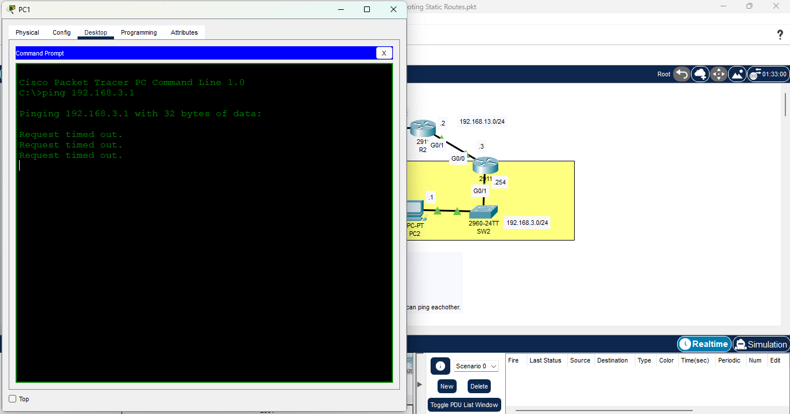  
*Figure 2: Ping Test from PC1 to PC2*

2. Checked IP Configuration on All Routers - Verified the IP addresses on each router.
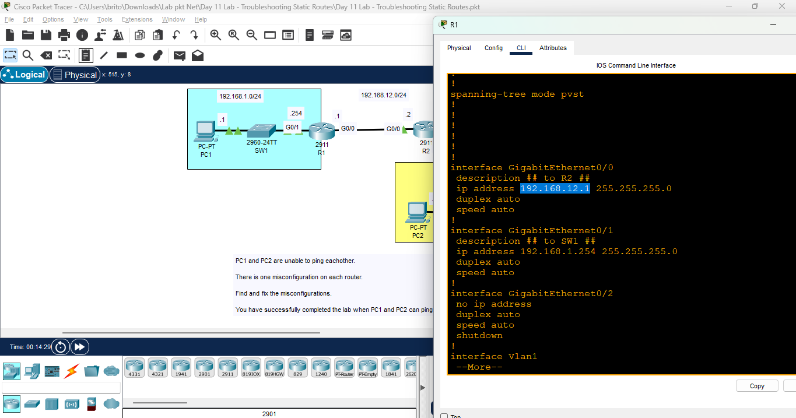  
*Figure 3: R1 IP configurations*

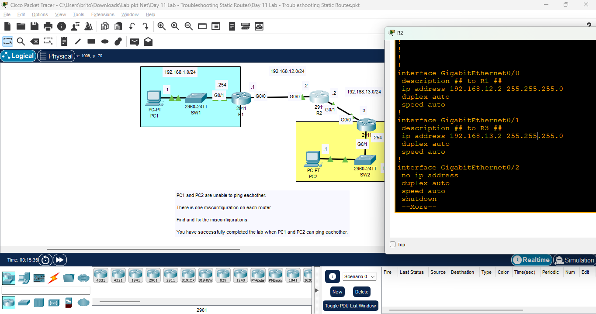  
*Figure 4: R2 IP configurations*

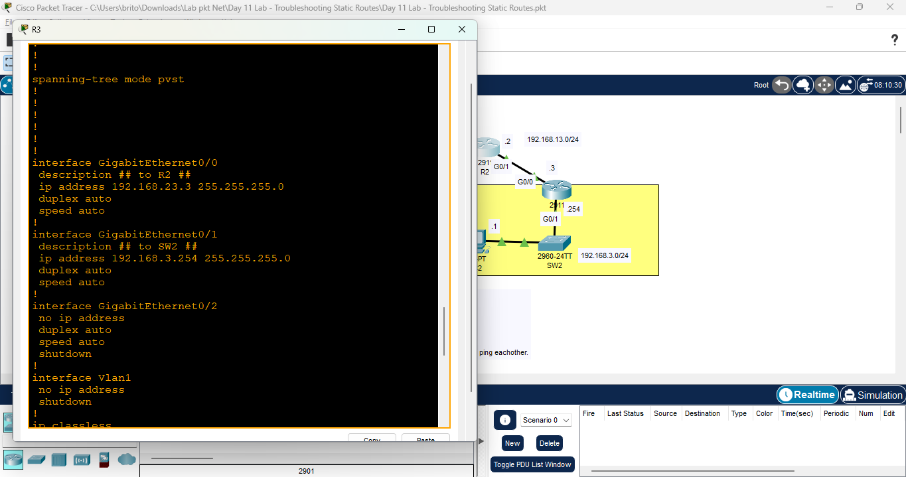  
*Figure 5: R3 configurations*

- FINDINGS: 
    1. R3's interface G0/0 was misconfigured with the IP address **192.168.23.3** instead of **192.168.13.3**
    2. R1 and R2 had correctly configured IP addresses.

3. Fixed R3’s IP Configuration - Corrected the IP address of R3’s G0/0 interface
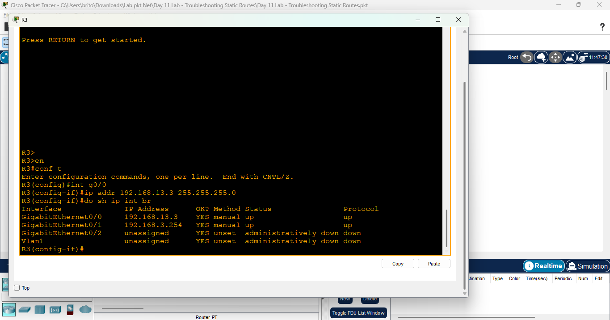    
*Figure 6: Fixed R3 IP Configuration*

4. Verified Static Routes with show ip route - Reviewed routing tables on all routers.
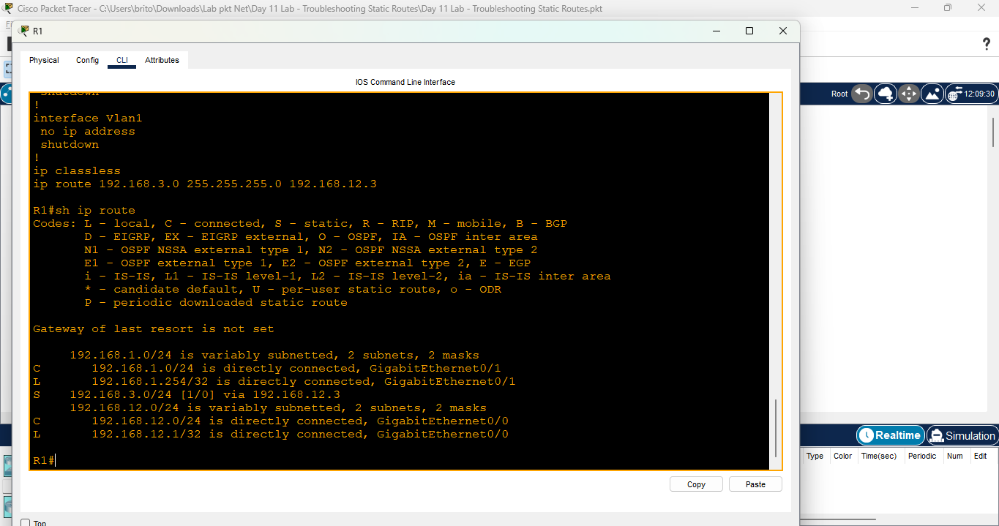  
*Figure 7: R1 Static Routing Table*

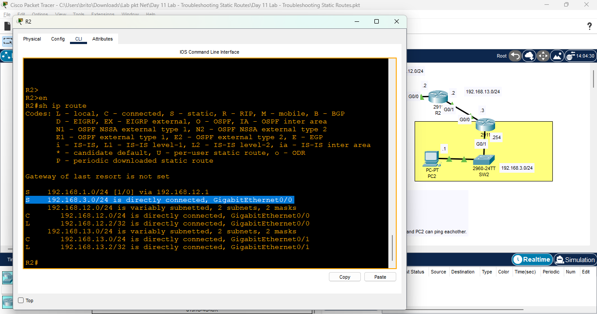  
*Figure 8: R2 Static Routing Table*

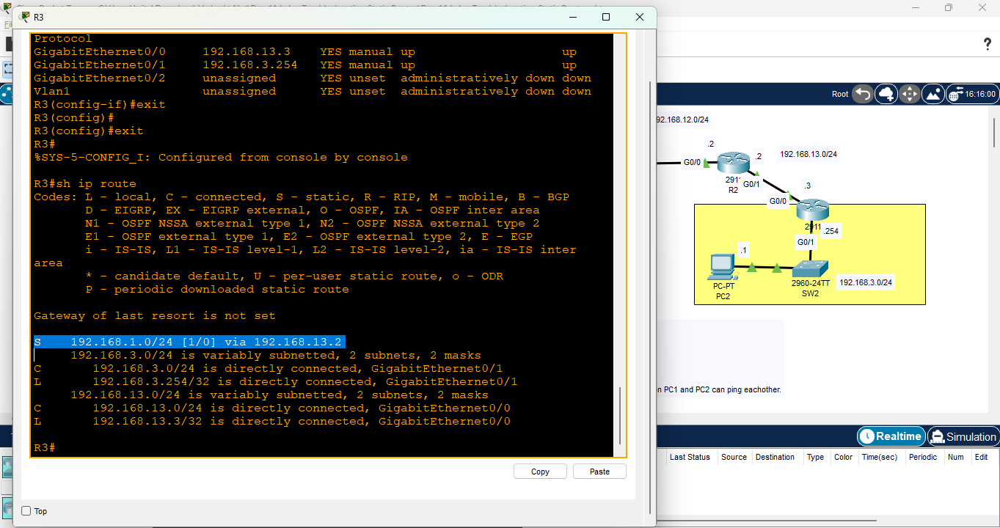  
*Figure 9: R3 Static Routing Table*

- FINDINGS:
    1. R1 had a static route misconfigured as: **S 192.168.3.0/24 [1/0] via 192.168.12.3** It should be via **192.168.12.2**.
    2. R2 incorrectly identified the **192.168.3.0/24** network as directly connected via G0/0.
It should route via **192.168.13.3** instead.
    3. R3’s routing table was correctly configured.

5. Fixed Static Route Misconfigurations - Updated the routing tables on R1 and R2.
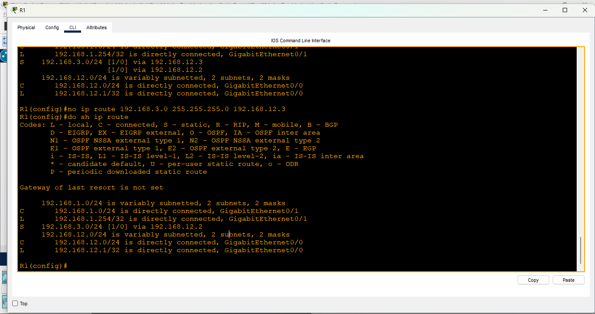  
*Figure 10: Fixed R1 Static Routing Table*

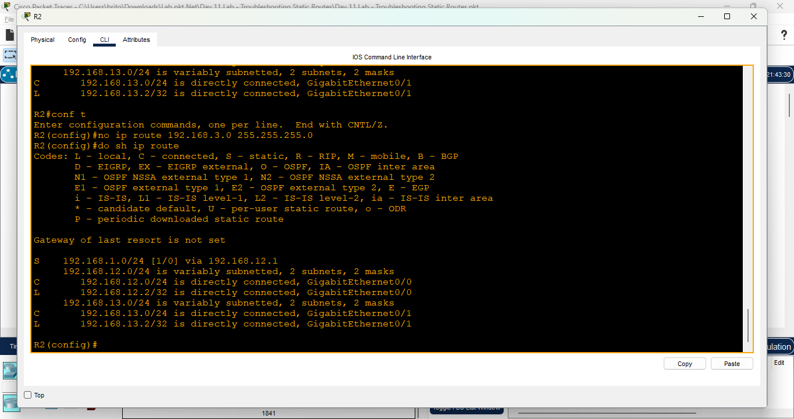  
*Figure 11: Fixed R2 Static Routing Table*

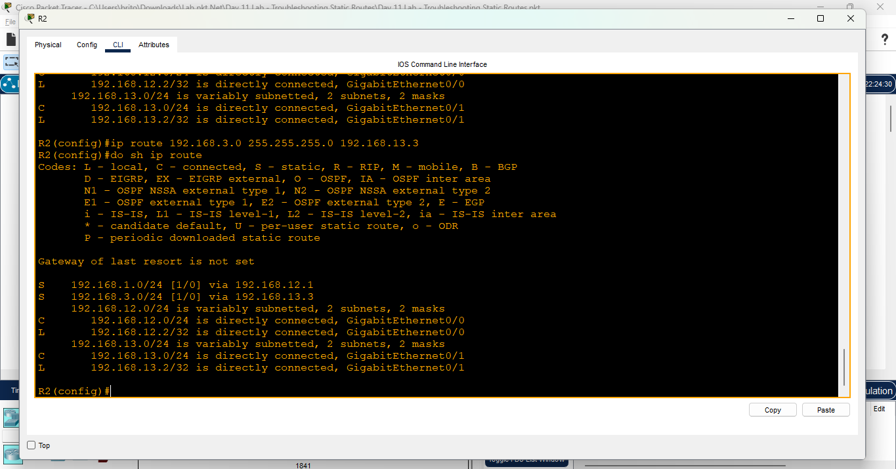  
*Figure 12: Fixed R2 Static Routing Table*

6. Final Connectivity Test - Re-tested connectivity using ping.
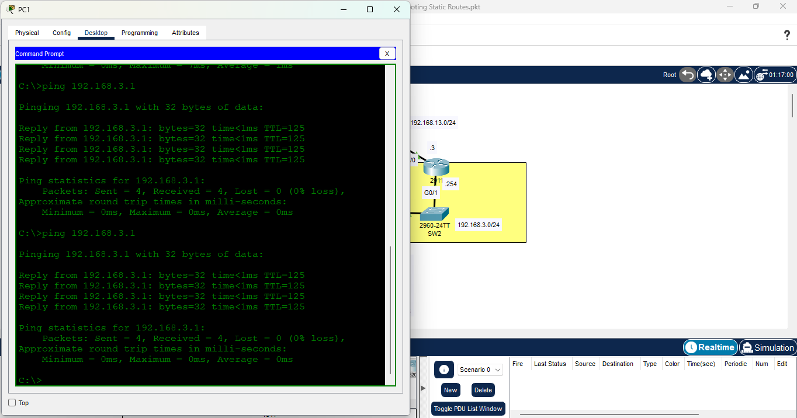  
*Figure 13: Ping Test Results*

## Reflection
- I learned how to troubleshoot static routing issues, identify misconfigured IP addresses, and fix incorrect static routes.
- I am becoming more confident using CLI commands and interpreting command outputs.
- This lab reinforced my understanding of how static routing works and how misconfigurations can affect network communication.

