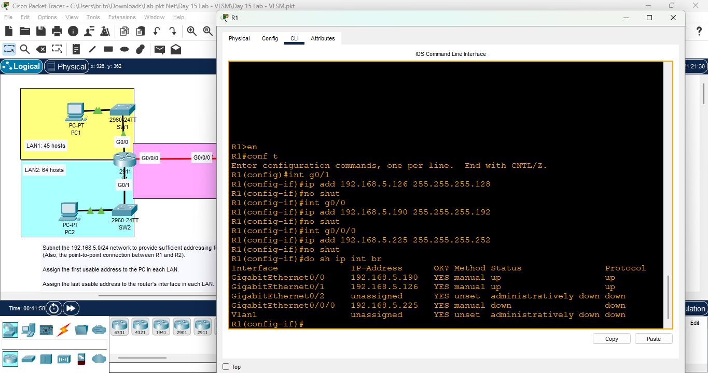
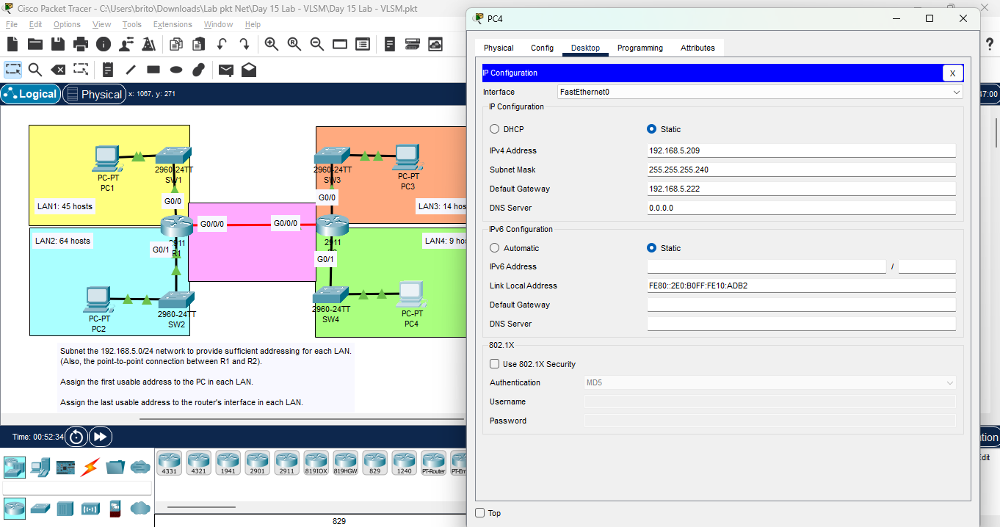

# Day 15 Lab - VLSM

**Name:** John Ashley Britos  
**Date:** July 14, 2025  
**Lab Title:** Day 15 Lab - VLSM         
**Lab Tool:** Cisco Packet Tracer  
**File Name:** `Day 15 Lab - VLSM.pkt`

---

## Objectives
Subnet the 192.168.5.0/24 network to provide sufficient addressing for each LAN.
(Also, the point-to-point connection between R1 and R2).
Assign the first usable address to the PC in each LAN.
Assign the last usable address to the router's interface in each LAN.
Configure static routes on each router so that all PCs can ping eachother.

---

## Network Topology

*Figure 1: Network Topology*

---

## Steps Performed
1. Planned Subnetting - Used VLSM to determine subnet sizes for each LAN.

| Subnet           | Network Address  | First Usable | Last Usable  | Broadcast Address | LAN   |
-------------------------------------------------------------------------------------------------
| 192.168.5.0/25   | 192.168.5.0      | 192.168.5.1  | 192.168.5.126| 192.168.5.127     | LAN2  | 
| 192.168.5.128/26 | 192.168.5.128    | 192.168.5.129| 192.168.5.190| 192.168.5.191     | LAN1  |
| 192.168.5.192/28 | 192.168.5.192    | 192.168.5.193| 192.168.5.206| 192.168.5.207     | LAN3  |
| 192.168.5.208/28 | 192.168.5.208    | 192.168.5.209| 192.168.5.222| 192.168.5.223     | LAN4  |
| 192.168.5.224/30 | 192.168.5.224    | 192.168.5.225| 192.168.5.226| 192.168.5.227     | P2P   |

2. Configured Router Interfaces - Assigned IP addresses to each router interface based on the subnet plan.

*Figure 2: R1 Interface Configuration*

*Figure 3: R2 Interface Configuration*

3. Assigned IP addresses to PCs in each LAN.

*Figure 4: PC IP Configuration*

*Figure 5: PC IP Configuration*

*Figure 6: PC IP Configuration*

*Figure 7: PC IP Configuration*

4. Configured Static Routes on Each Router - Ensured all PCs could communicate with each other.

*Figure 8: R1 Static Route Configuration*

*Figure 9: R2 Static Route Configuration*

5. Checked Connectivity - Used the ping command to test connectivity between all PCs.

*Figure 10: Ping Test across all PCs*

## Reflection
- I learned how to effectively use VLSM (Variable Length Subnet Masking) to optimize IP address allocation.
- It reinforced my understanding of subnetting and configuring static routes to ensure full connectivity.