# Day 16 Lab - VLANs (Part 1)

**Name:** John Ashley Britos  
**Date:** July 16, 2025  
**Lab Title:** Day 16 Lab - VLANs (Part 1)             
**Lab Tool:** Cisco Packet Tracer   
**File Name:** `Day 16 Lab - VLANs (Part 1).pkt`

---

## Objectives
1. Configure the correct IP address/subnet mask on each PC.
    Set the gateway address as the LAST USABLE address of the subnet.

2. Make three connections between R1 and SW1.
    Configure one interface on R1 for each VLAN.
    Make sure the IP addresses are the gateway address you configured on the PCs.

3. Configure SW1's interfaces in the proper VLANs.
    Remember the interfaces that connect to R1!
    Name the VLANs
     (Engeering, HR, Sales)

4. Ping between the PCs to check connectivity.
    Send a broadcast ping from a PC (ping the subnet broadcast address),
     and see which PCs devices receive the broadcast
      (use Packet Tracer's 'Simulation Mode')

## Network Topology
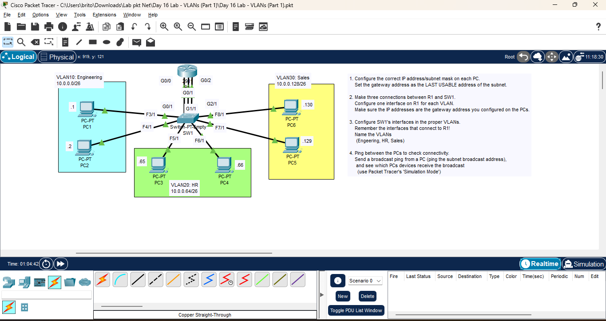
*Figure 1: Network Topology*

---

## Steps Performed
1. Added a connection between R1 and SW1.
   - Used the correct cable type (straight-through).
   - Connected to the correct interfaces on both devices.
   - assigned IP addresss to the interfaces on R1.
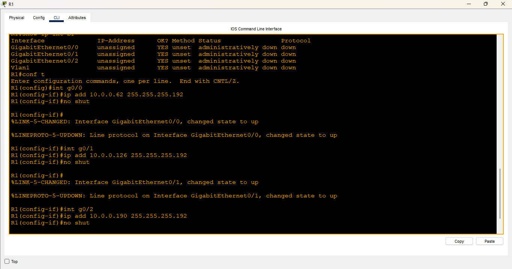
*Figure 2: R1 Interface Configuration*

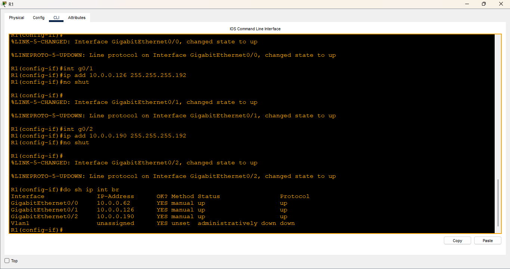
*Figure 3: R1 Interface Configuration*

2. Configured PCs with the correct IP addresses and subnet masks.
   - Assigned the last usable address of each subnet as the gateway.

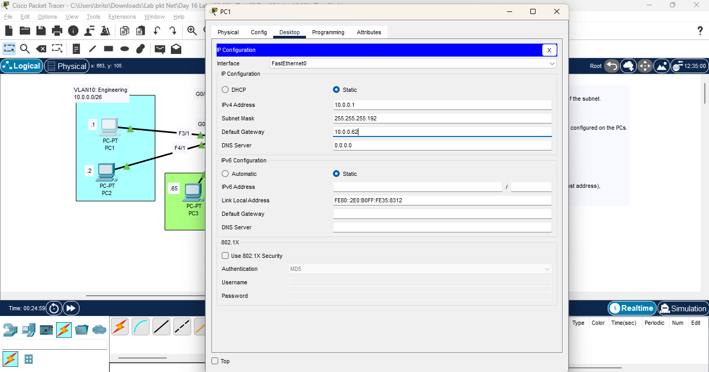
*Figure 3: PC IP Configuration*

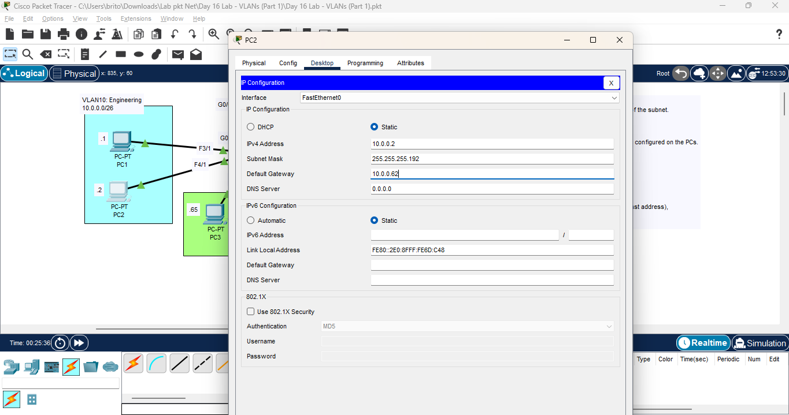
*Figure 4: PC IP Configuration*

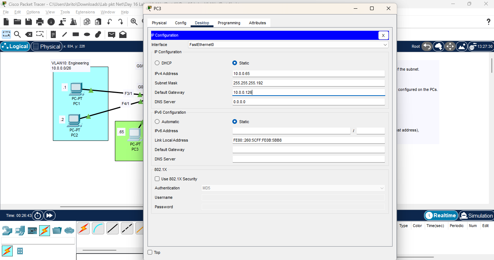
*Figure 5: PC IP Configuration*

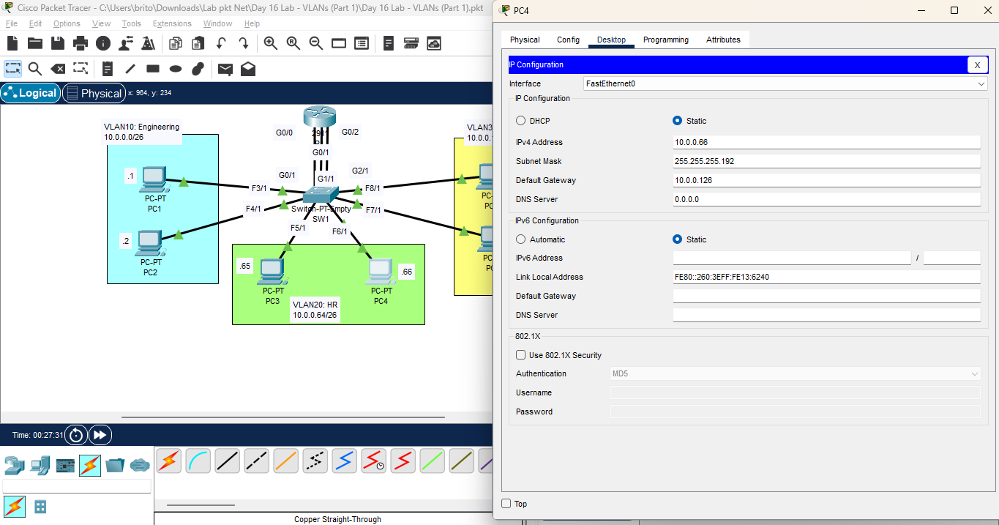
*Figure 6: PC IP Configuration*

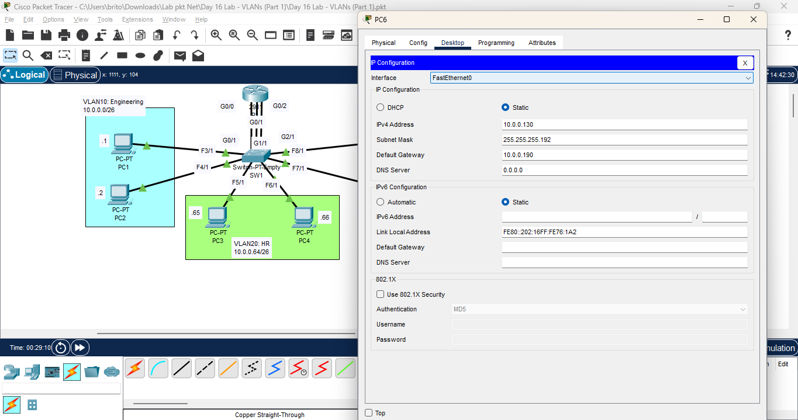
*Figure 7: PC IP Configuration*

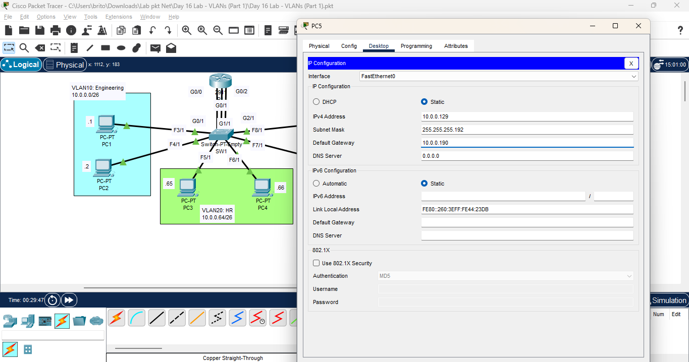
*Figure 8: PC IP Configuration*

3. Configured VLANs on SW1.
   - Created VLANs for Engineering, HR, and Sales.
   - Assigned interfaces to the respective VLANs.

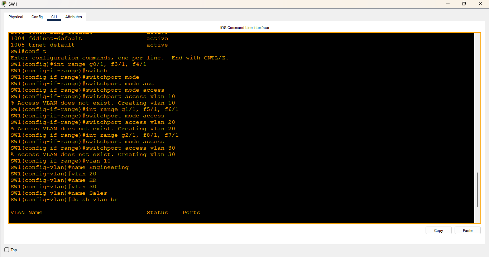
*Figure 10: SW1 VLAN Configuration*

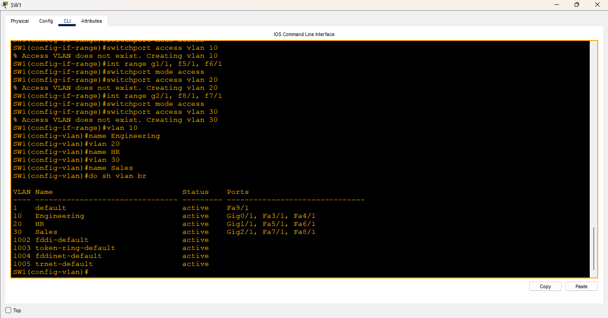
*Figure 11: SW1 VLAN Configuration*

4. Checked connectivity between PCs.
   - Used the ping command to test connectivity between PCs in different VLANs.
   - Sent a broadcast ping from one PC to see which devices received it.

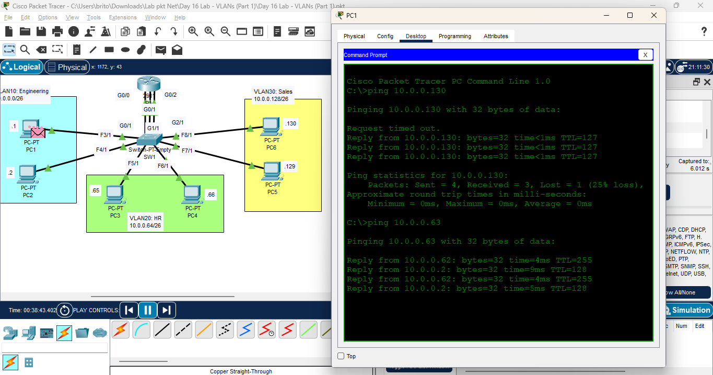
*Figure 12: Ping Test across all PCs*

# Reflection
- I learned how to configure basic VLANS and implement inter-VLAN routing.
- Reinforced my understanding of IP addressing and subnetting.

