# Day 17 Lab - VLANs (Part 2)

**Name:** John Ashley Britos  
**Date:** July 17, 2025  
**Lab Title:** Day 17 Lab - VLANs (Part 2)             
**Lab Tool:** Cisco Packet Tracer   
**File Name:** `Day 17 Lab - VLANs (Part 2).pkt`

---

## Objectives
1. Configure the switch interfaces connected to PCs as access ports in the correct VLAN.

2. Configure the connection between SW1 and SW2 as a trunk, allowing only the necessary VLANs.
    Configure an unused VLAN as the native VLAN.
    **Make sure all necessary VLANs exist on each switch**

3. Configure the connection between SW2 and R1 using 'router on a stick'.
     Assign the last usable address of each subnet to R1's subinterfaces.

4. Test connectivity by pinging between PCs.  All PCs should be able to reach each other.

## Network Topology
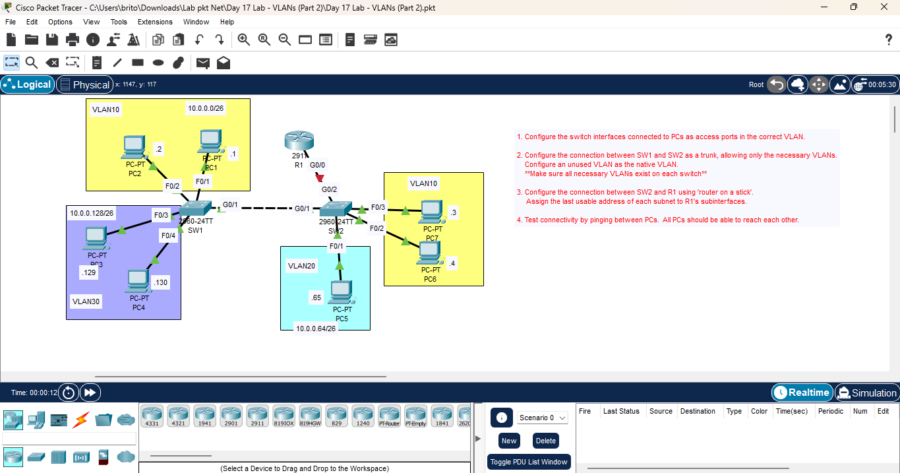
*Figure 1: Network Topology*

---

## Steps Performed
1. configured the switch interfaces connected to PCs as access ports in the correct VLANs.
   - Used the `switchport mode access` command to set the interfaces.
   - Assigned each interface to its respective VLAN.

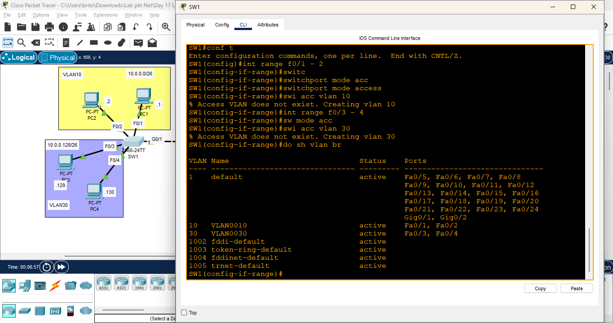
*Figure 2: SW1 Interface Configuration*

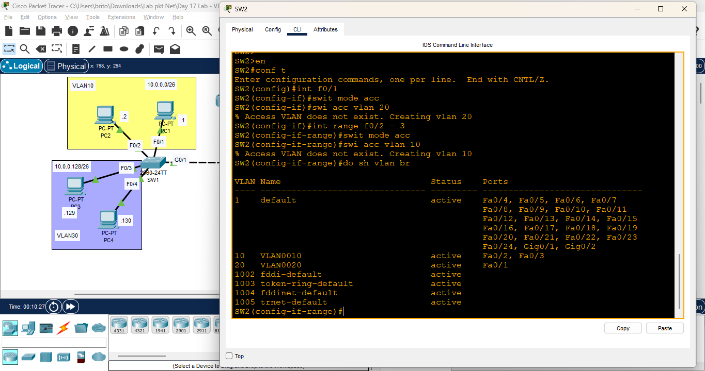
*Figure 3: SW2 Interface Configuration*

2.  configured the connection between SW1 and SW2 as a trunk.
   - Used the `switchport mode trunk` command on the interface connecting to SW2.
   - Set an unused VLAN as the native VLAN.

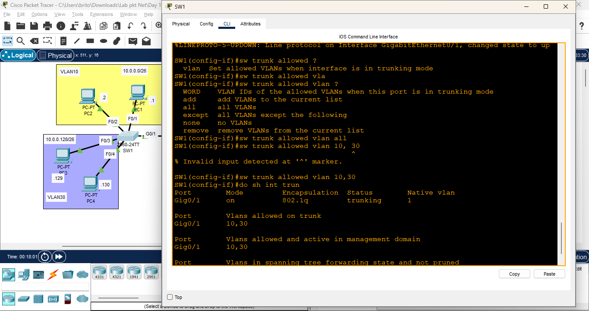
*Figure 4: Trunk Configuration*

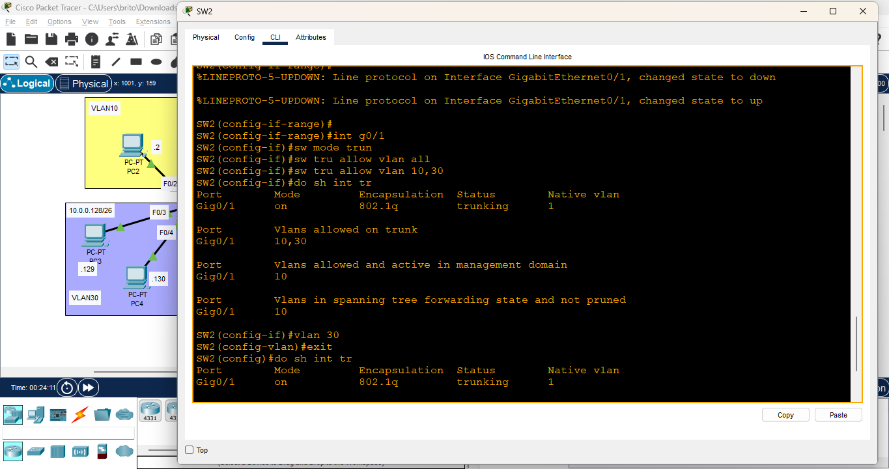
*Figure 5: Trunk Configuration*

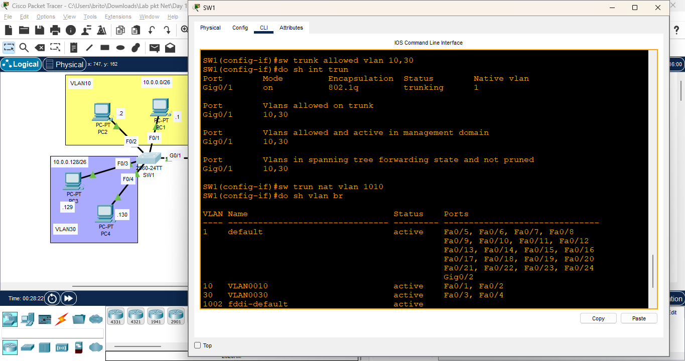
*Figure 6: Trunk Configuration*

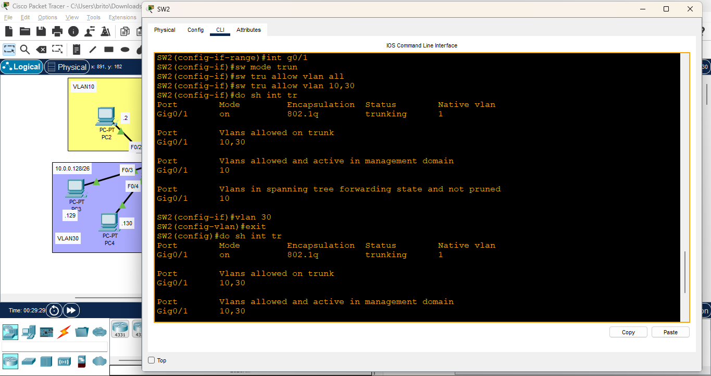
*Figure 7: Trunk Configuration*

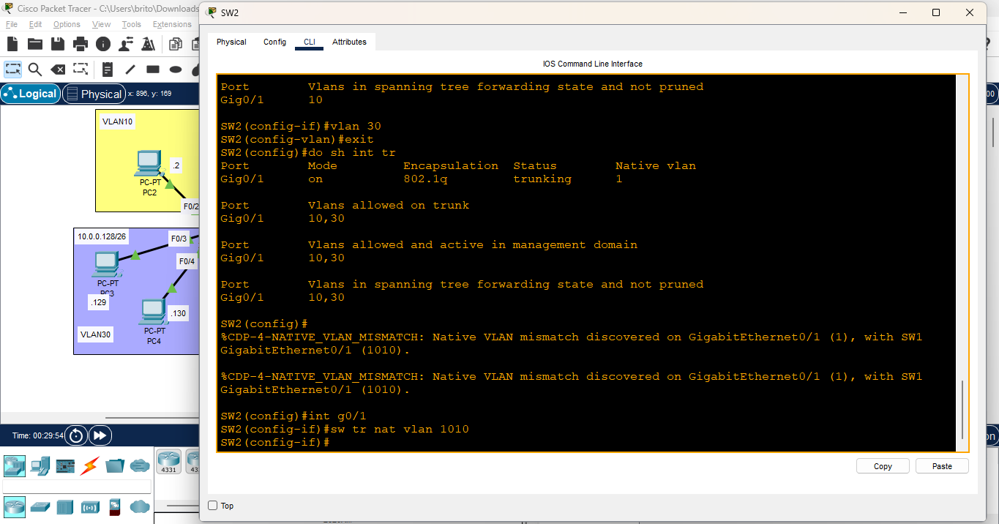
*Figure 8: Trunk Configuration*

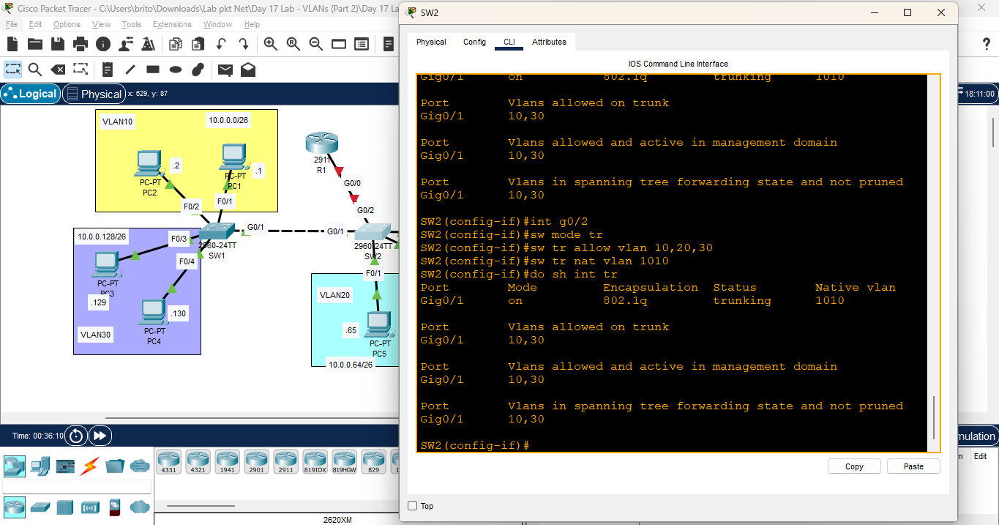
*Figure 9: Trunk Configuration*

3. Configured the connection between SW2 and R1 using 'router on a stick'.
   - Created subinterfaces on R1 for each VLAN.
   - Assigned the last usable address of each subnet to the subinterfaces.

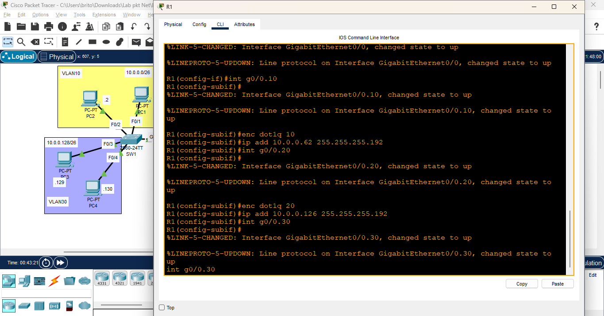
*Figure 10: R1 Subinterface Configuration*

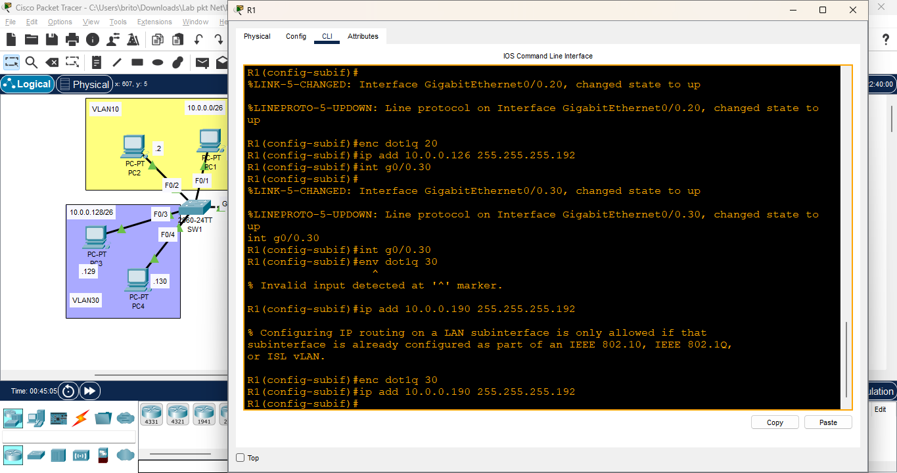
*Figure 11: R1 Subinterface Configuration*

4. Tested connectivity by pinging between PCs.
   - Verified that all PCs could reach each other successfully.

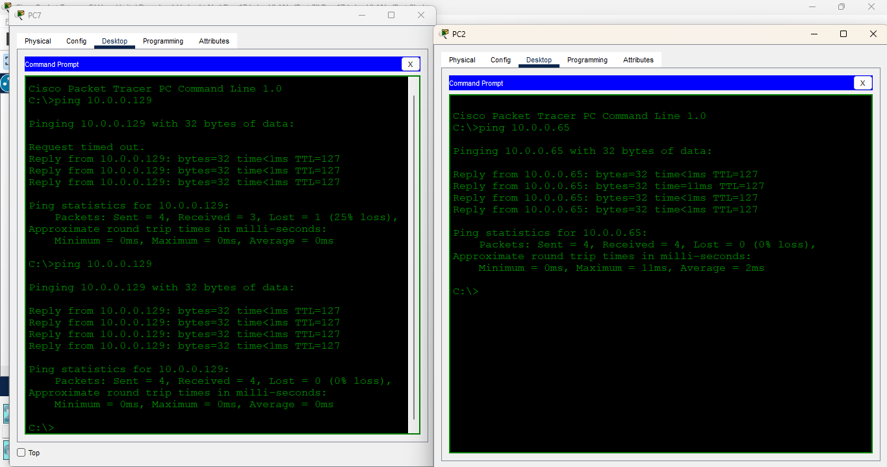
*Figure 12: Ping Test across all PCs*

## Reflection
- Learned how to use trunking to allow multiple VLANs to communicate between switches.
- Gained experience in configuring 'router on a stick' for inter-VLAN routing.
- Understood the importance of native VLANs in trunk configurations.